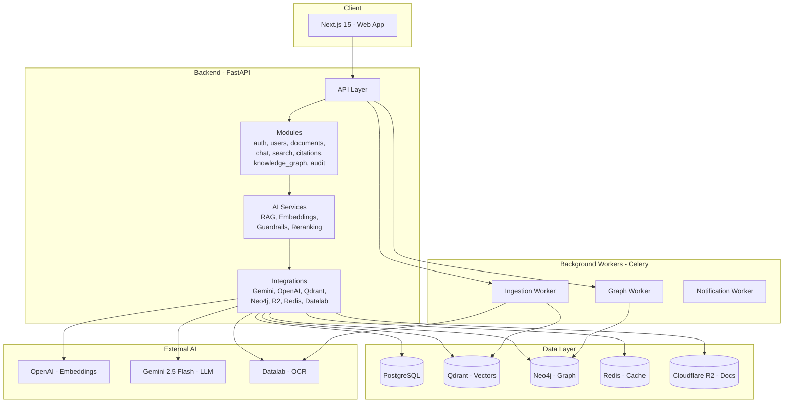
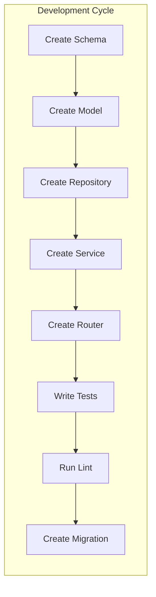
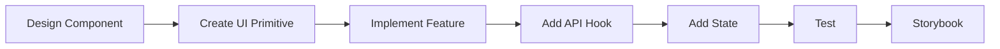
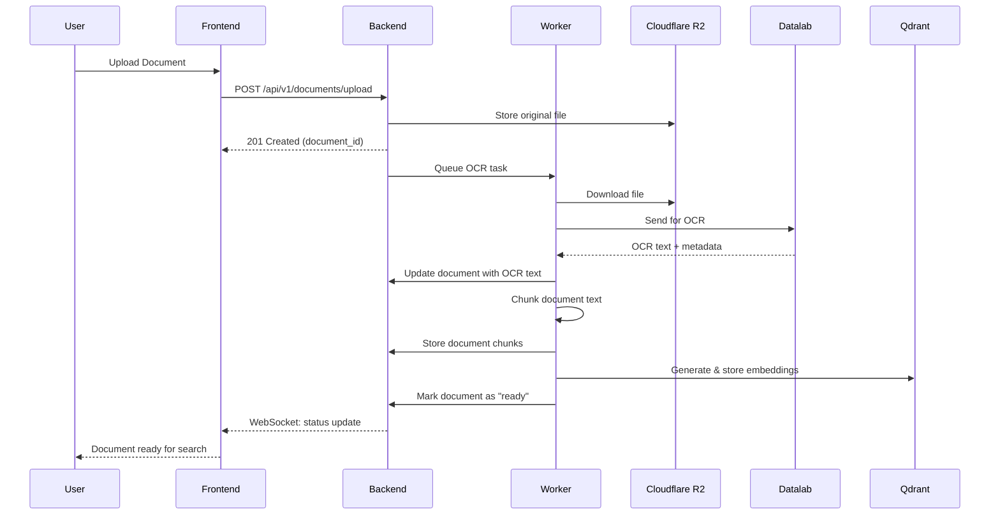
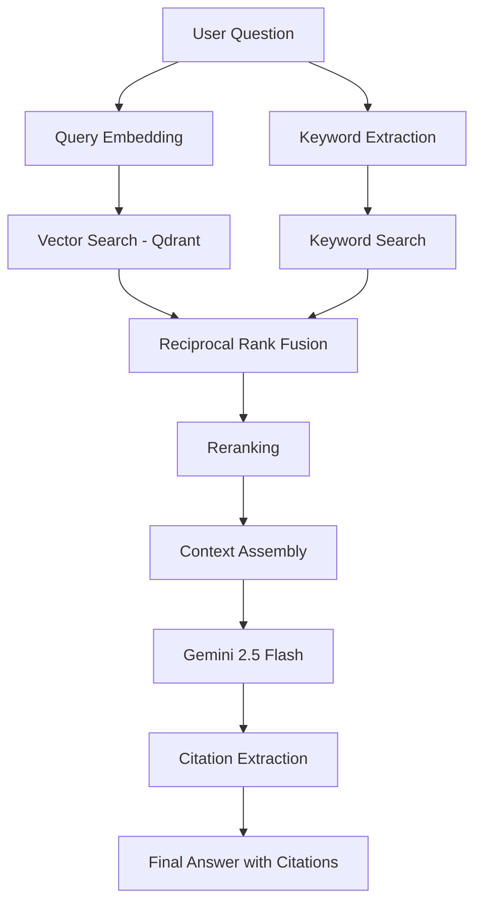
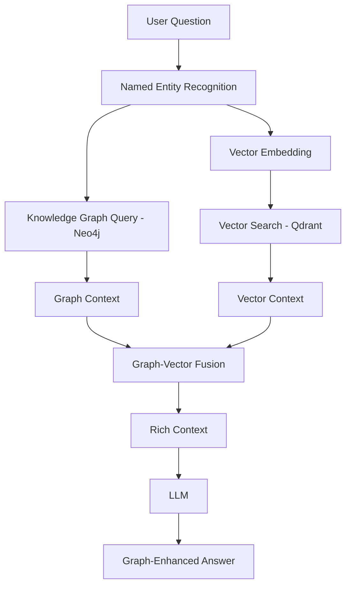
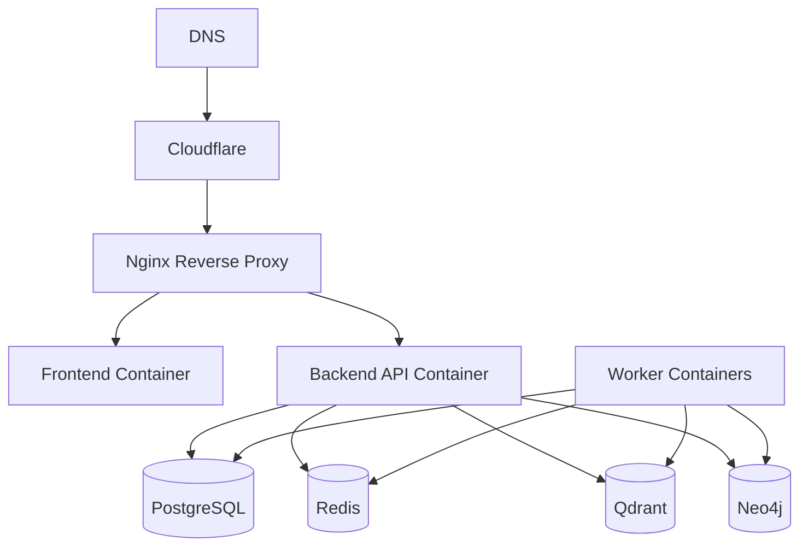

> **Design document.** This describes the target architecture and roadmap for CaseVault. Most of it is not implemented yet. See [README.md](README.md) for what is actually built (Phase 1).

# CaseVault — AI-Powered Legal Intelligence Platform

<div align="center">

**Intelligent document management and AI-powered legal research for Bangladesh law firms.**

[](https://github.com/yourorg/casevault/actions/workflows/ci.yml)
[](https://www.python.org/downloads/)
[](https://fastapi.tiangolo.com/)
[](https://nextjs.org/)
[](LICENSE)

</div>

---

## Project Vision

CaseVault aims to transform legal research and document management for Bangladeshi law firms. We combine OCR, vector search, knowledge graphs, and large language models to create an AI-powered legal assistant that helps lawyers find relevant case law, statutes, and legal precedents faster than ever before.

**Our mission**: *Make every Bangladeshi lawyer more productive with AI-powered legal intelligence.*

---

## Product Overview

### Core Features

| Feature | Description | Status |
|---|---|---|
| **Document Upload** | Upload PDFs, Word docs, and images | Foundation |
| **OCR Processing** | Convert scanned documents to searchable text via Datalab | Foundation |
| **Legal Knowledge Base** | Searchable repository of firm documents | Core |
| **AI Chat** | Chat with AI about legal documents | Core |
| **Citation-Backed Answers** | Answers include source citations | Core |
| **Private Knowledge Vaults** | Firm-scoped document isolation | Core |
| **Semantic Search** | Search by meaning, not just keywords | Intelligence |
| **Knowledge Graph** | Entity and relationship extraction via Neo4j | Advanced |

### Target Users

- **Law firms** of all sizes in Bangladesh
- **Legal researchers** needing quick precedent access
- **Paralegals** managing document workflows
- **Law students** researching case law

---

## Architecture Diagram



---

## Folder Structure

```
CaseVault/
│
├── frontend/                  # Next.js 15 Web Application
│   ├── src/
│   │   ├── app/              # App Router pages
│   │   ├── components/       # UI, layout, feature components
│   │   ├── hooks/            # Custom React hooks
│   │   ├── lib/              # Utilities, API client
│   │   ├── stores/           # Zustand state stores
│   │   ├── types/            # TypeScript type definitions
│   │   └── config/           # Frontend configuration
│   ├── public/               # Static assets
│   └── package.json
│
├── backend/                   # FastAPI Application
│   ├── app/
│   │   ├── core/             # Config, security, events, logging
│   │   ├── database/         # SQLAlchemy engine, migrations
│   │   ├── models/           # ORM model re-exports
│   │   ├── shared/           # Enums, types, pagination, errors
│   │   ├── modules/          # Domain modules (10 modules)
│   │   │   ├── auth/
│   │   │   ├── users/
│   │   │   ├── firms/
│   │   │   ├── documents/
│   │   │   ├── chat/
│   │   │   ├── citations/
│   │   │   ├── knowledge_graph/
│   │   │   ├── search/
│   │   │   ├── audit/
│   │   │   └── admin/
│   │   ├── integrations/     # External service clients (8)
│   │   └── ai/               # AI services (6 modules)
│   ├── tests/                # Pytest test suite
│   ├── alembic.ini           # Migration config
│   └── pyproject.toml        # Project metadata
│
├── workers/                   # Celery Background Workers
│   ├── ingestion/            # Document processing tasks
│   ├── graph/               # Knowledge graph tasks
│   ├── notifications/       # Notification tasks
│   └── shared/              # Celery app, config
│
├── docker/                    # Dockerfiles
│   ├── Dockerfile.backend
│   ├── Dockerfile.frontend
│   ├── Dockerfile.workers
│   └── nginx.conf
│
├── docs/                      # Documentation (18 files)
│   ├── architecture.md
│   ├── backend.md
│   ├── frontend.md
│   ├── database.md
│   ├── api.md
│   ├── deployment.md
│   ├── docker.md
│   ├── rag.md
│   ├── graphrag.md
│   ├── ocr.md
│   ├── embeddings.md
│   ├── neo4j.md
│   ├── qdrant.md
│   ├── security.md
│   ├── roadmap.md
│   ├── contributing.md
│   ├── coding-standards.md
│   └── testing.md
│
├── scripts/                   # Development scripts
├── .github/workflows/         # CI/CD pipelines
│
├── docker-compose.yml         # Local development orchestration
├── .env.example               # Environment template
├── .gitignore
├── .pre-commit-config.yaml    # Pre-commit hooks
├── LICENSE                    # MIT License
└── README.md                  # This file
```

---

## Technology Stack

### Frontend
| Technology | Purpose | Version |
|---|---|---|
| **Next.js** | React framework with SSR | 15 |
| **TypeScript** | Type safety | 5.5+ |
| **TailwindCSS** | Utility-first CSS | 3.4+ |
| **Shadcn UI** | Component library | Latest |
| **React Query** | Server state management | 5 |
| **Zustand** | Client state management | 4 |
| **React Hook Form** | Form management | 7 |
| **Zod** | Schema validation | 3 |

### Backend
| Technology | Purpose | Version |
|---|---|---|
| **FastAPI** | Web framework | 0.115 |
| **Python** | Runtime | 3.11 |
| **SQLAlchemy** | ORM | 2.0 |
| **Alembic** | Migrations | 1.13 |
| **Pydantic** | Validation | 2 |
| **Celery** | Background tasks | 5.4 |
| **Redis** | Cache & broker | 7 |

### AI & ML
| Technology | Purpose |
|---|---|
| **Gemini 2.5 Flash** | Primary LLM |
| **OpenAI text-embedding-3-large** | Embeddings (3072d) |
| **Datalab** | OCR processing |
| **Qdrant** | Vector database |
| **Neo4j** | Knowledge graph |

### Infrastructure
| Technology | Purpose |
|---|---|
| **PostgreSQL 16** | Relational database |
| **Redis 7** | Cache & message broker |
| **Cloudflare R2** | Document storage |
| **Docker** | Containerization |
| **Docker Compose** | Orchestration |

---

## Development Phases

| Phase | Milestones | Timeline |
|---|---|---|
| **Foundation** | M0 — Project Foundation | Week 1-2 |
| **Core** | M1 — Auth, M2 — Upload, M3 — OCR, M4 — Embeddings | Week 3-8 |
| **Intelligence** | M5 — Search, M6 — RAG, M7 — Citations | Week 9-13 |
| **Advanced** | M8 — Knowledge Graph, M9 — Deployment | Week 14-17 |

See the full [Roadmap](docs/roadmap.md) for detailed milestones.

---

## Quick Start

### Prerequisites

- Python 3.11+
- Node.js 20+
- Git
- PostgreSQL 16 running on localhost:5432
- Redis 7 on localhost:6379 (optional — stubs provided)
- Qdrant on localhost:6333 (optional — stubs provided)
- Neo4j on localhost:7687 (optional — stubs provided)
- *or* Docker & Docker Compose (to run infrastructure in containers)

### Setup

```bash
# Clone the repository
git clone https://github.com/yourorg/casevault.git
cd casevault

# Copy environment configuration
cp .env.example .env
# Edit .env with your API keys

# Start infrastructure via Docker (or run natively)
docker compose up -d postgres redis qdrant neo4j

# Set up backend
cd backend
python -m venv .venv
source .venv/bin/activate  # Windows: .venv\Scripts\Activate.ps1
pip install -r requirements.txt -r requirements-dev.txt
cd ..

# Set up frontend
cd frontend
npm install
cd ..

# Install pre-commit hooks
pre-commit install

# Start backend
cd backend
uvicorn app.main:app --reload
```

> **Tip**: If you run PostgreSQL (and other services) natively instead of Docker, just ensure they are running before starting the backend. The app connects to `localhost` by default — see `.env.example` for all configurable settings.

### Access

| Service | URL |
|---|---|
| Frontend | http://localhost:3000 |
| Backend API | http://localhost:8000 |
| API Docs (Swagger) | http://localhost:8000/docs |
| Neo4j Browser | http://localhost:7474 |
| Qdrant Dashboard | http://localhost:6333 |

---

## Backend Workflow



1. **Schema** — Define Pydantic schemas (request/response)
2. **Model** — Define SQLAlchemy ORM model
3. **Repository** — Implement data access layer
4. **Service** — Implement business logic
5. **Router** — Wire up HTTP endpoints
6. **Tests** — Write unit + integration tests
7. **Lint** — Run ruff, mypy, black
8. **Migration** — Generate and review Alembic migration

---

## Frontend Workflow



---

## Document Ingestion Workflow



---

## RAG Pipeline



---

## Future GraphRAG



---

## Knowledge Graph

**Node Types**: Document, Case, Statute, Party, Judge, Court, Entity
**Relationship Types**: CITES, OVERRULES, REFERS_TO, INVOLVES, PRESIDED_BY, MENTIONS

Entities and relationships are extracted from legal documents during ingestion and stored in Neo4j for graph-enhanced retrieval.

---

## Deployment Overview



See [Deployment Guide](docs/deployment.md) for production setup.

---

## Team Responsibilities

| Role | Focus | Key Modules |
|---|---|---|
| **Backend Engineer** | API, database, integrations | All modules, integrations, AI |
| **Frontend Engineer** | UI, state, components | Frontend, API integration |
| **ML/AI Engineer** | RAG, embeddings, LLM | AI services, embeddings, search |
| **DevOps/Fullstack** | Infrastructure, CI/CD, Docker | Docker, deployment, monitoring |

---

## How New Developers Should Onboard

1. **Read the [Architecture](docs/architecture.md)** documentation
2. **Follow the [Quick Start](#quick-start)** to set up the environment
3. **Read [Backend](docs/backend.md)** or **[Frontend](docs/frontend.md)** docs based on your role
4. **Review [Coding Standards](docs/coding-standards.md)**
5. **Read [Contributing Guidelines](docs/contributing.md)**
6. **Understand the [Roadmap](docs/roadmap.md)** to see where we're going
7. **Pick a task** from the active milestone
8. **Create a branch**, implement, submit PR

---

## How to Contribute

1. Pick a task from the project board
2. Create a feature branch from `develop`
3. Follow [coding standards](docs/coding-standards.md)
4. Write tests
5. Run linters
6. Submit a PR to `develop`
7. Get review, address feedback, merge

See [Contributing](docs/contributing.md) for full details.

---

## Branching Strategy

```
main         ── Production
  └── develop ── Integration
       ├── feature/xxx
       ├── fix/xxx
       ├── refactor/xxx
       └── docs/xxx
```

---

## Coding Conventions

| Language | Formatter | Linter | Type Checker |
|---|---|---|---|
| **Python** | Black (88) | Ruff | mypy |
| **TypeScript** | Prettier (80) | ESLint | tsc |

See [Coding Standards](docs/coding-standards.md) for full details.

---

## Project Philosophy

1. **Simplicity over complexity** — Solve today's problems well, don't over-engineer for tomorrow
2. **Modular by design** — Each module is independently understandable and testable
3. **Security first** — Every endpoint auth'd, every input validated, every action logged
4. **Test-driven** — No code is complete without tests
5. **Documentation as code** — Docs live with the code, updated with every change
6. **Convention over configuration** — Consistent patterns reduce cognitive load
7. **Fail fast, fail clearly** — Errors should be detected early and explained well
8. **Iterate quickly** — Ship small, frequent improvements

---

## License

This project is licensed under the MIT License — see the [LICENSE](LICENSE) file for details.

---


